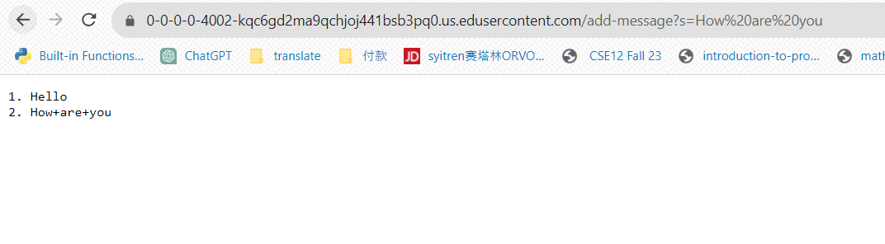

The method handleRequest is being called. This code has one argument which is url. It takes in the url and sees if the path contains 
"/add message", if so, it will get Query and split it with "=". Then it will check if there is an s before the equal sign, then, for
this specific picture, it will check if the number is zero, which is checking if <string> has been called. If the number is not zero,
it will store the parameter after = which is "Hello" and num into a return statement  and let num plus one. Finally, return return_string

The method handleRequest is being called. This code has one argument which is url. It takes in the url and sees if the path contains 
"/add message", if so, it will get Query and split it with "=". Then it will check if there is an s before the equal sign, then, for
this specific picture, it will check if the number is zero, which is checking if <string> has been called. If the number is not zero,
it will store the parameter after = which is "How are you" and num into a return statement  and let num plus one. Finally, return return_string

Code:
import java.io.IOException;
import java.net.URI;

class Handler implements URLHandler {
    // The one bit of state on the server: a number that will be manipulated by
    // various requests.
    int num = 0;
    String return_string = "";

    public String handleRequest(URI url) {
        if (url.getPath().equals("/")) {
            return return_string;
        } 
        else if (url.getPath().equals("/add-message")) {
            String[] parameters1 = url.getQuery().split("=");
            if (parameters1[0].equals("s")) {
                if(parameters1[1].equals("<string>")){
                     num+=1;
                     return return_string;
                }
                else{
                    if(num != 0){   
                        return_string += String.format("%d. %s",num, parameters1[1]) + "\n";
                        num++;
                        return return_string;
                    }
                }  
            }
            return "404 Not Found!";
            
        } 
        else {
            
            return "404 Not Found!";
        }
    }
}

class NumberServer {
    public static void main(String[] args) throws IOException {
        if(args.length == 0){
            System.out.println("Missing port number! Try any number between 1024 to 49151");
            return;
        }

        int port = Integer.parseInt(args[0]);

        Server.start(port, new Handler());
    }
}

Part2

